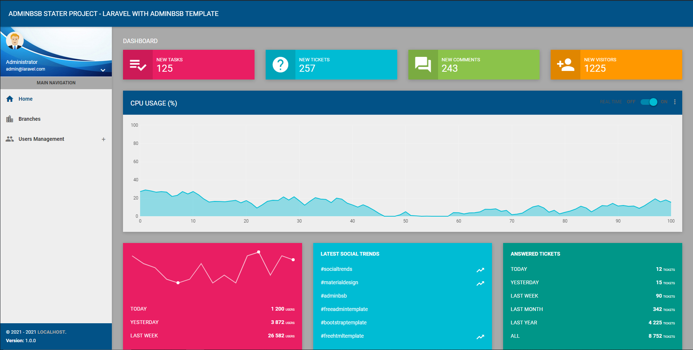
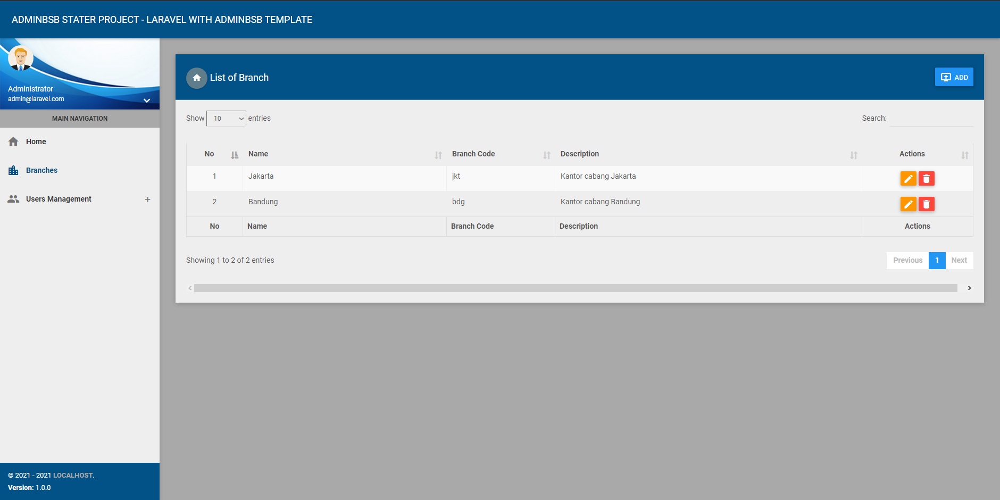
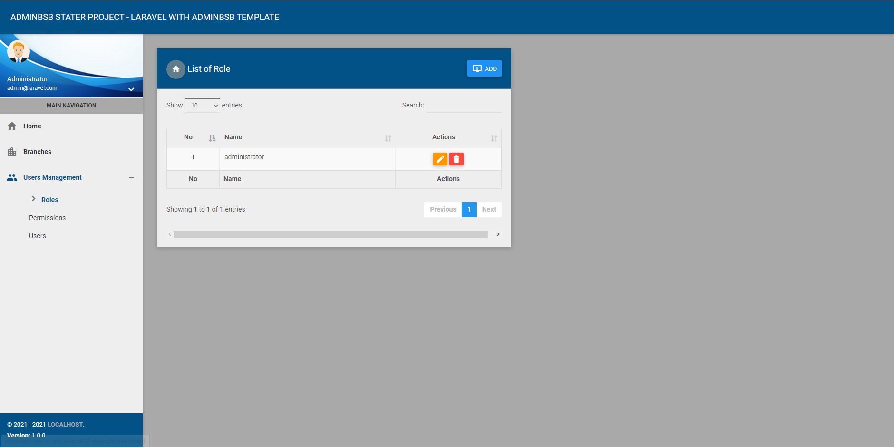
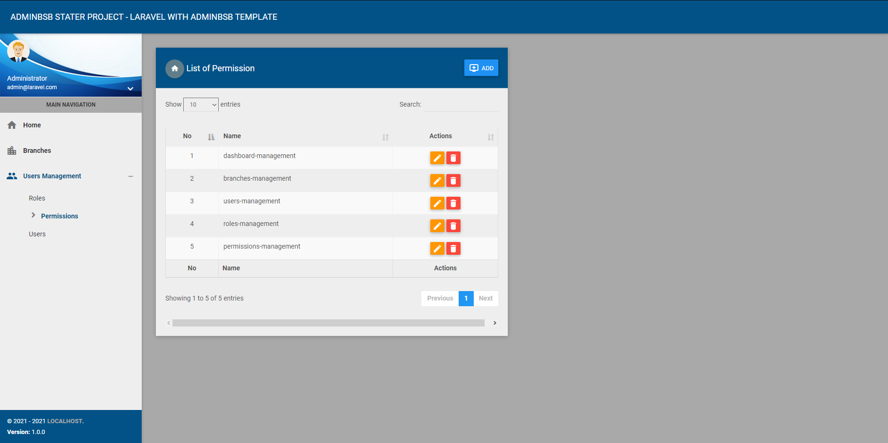
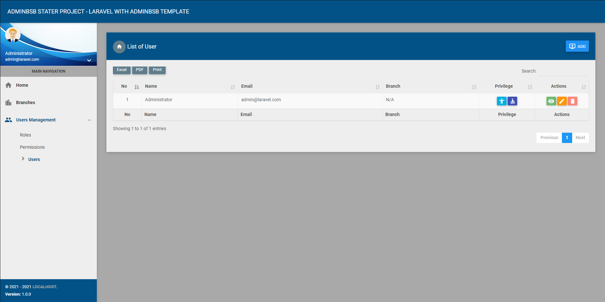
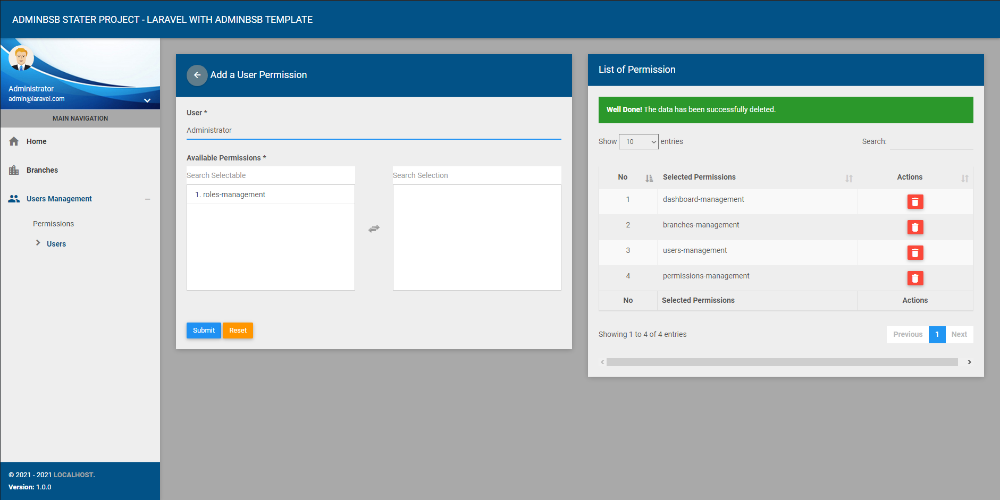

## Laravel with Admin BSB admin template for starter project

This project using Laravel Framework version 5.8 and Admin BSB template. this is a starter project with some basic features.

## Modules:

- Simple Dashboard
- Branches Management
- Users Management
  - Roles
  - Permissions
  - Users

## Features:

- Forgot password
- Users privilege with Roles and Permissions
- Data table server side
- Log activities

## Pre Requirement

- PHP >= 7.2
- Web server XAMPP or recomended using [Laravel Homestead](https://laravel.com/docs/5.8/homestead)
- Composer version 1.10.X
- To avoid error when installing package: Try increasing the memory_limit in your php.ini file (ex. /etc/php5/cli/php.ini for Debian-like or windows C:\Program Files\PHP\php-7.X\php.ini) for more information click [here](https://getcomposer.org/doc/articles/troubleshooting.md#memory-limit-errors)
- For complete server requirment about laravel 5.8 please go to official page: click [here](https://laravel.com/docs/5.8#server-requirements).

## How to install

- Clone project.
- Open terminal (Git Bash or CMD) and go to the project root directory 
- Run ``` composer install ```
- Start service MySQL on XAMPP
- Create database on PHPMyAdmin
- Copy .env.example with command ``` cp .env.example .env ```
- Setup database on .env file
- Example:
    - DB_CONNECTION=mysql
    - DB_HOST=127.0.0.1
    - DB_PORT=3306
    - DB_DATABASE=your_db_name
    - DB_USERNAME=root
    - DB_PASSWORD=
- run ``` php artisan key:generate ``` 
- run ``` php artisan migrate --seed ```
- run ``` php artisan serve ``` 
- Done!

## Contact Me

If you have some trouble or question when installing this project, please send an e-mail to me via [indra.ndra26@gmail.com](mailto:indra.ndra26@gmail.com).
and treat me a cup of coffee :coffee: :ok_hand:.

## User Admin Login
**Email:**
admin@laravel.com
**Password:**
secret

## Credits

- [Admin BSB Template](https://github.com/gurayyarar/AdminBSBMaterialDesign)
- [spatie/laravel-activitylog:3.9.1](https://spatie.be/docs/laravel-activitylog/v3/introduction)
- [spatie/laravel-backup:5.0.0](https://spatie.be/docs/laravel-backup/v5/introduction)
- [spatie/laravel-permission:3.17.0](https://spatie.be/docs/laravel-permission/v3/introduction)
- [yajra/laravel-datatables-oracle:9.0](https://yajrabox.com/docs/laravel-datatables/master/installation)
- [intervention/image:2.5](http://image.intervention.io)
- [hisorange/browser-detect:3.0](https://github.com/hisorange/browser-detect)
- [maatwebsite/excel:3.1](https://docs.laravel-excel.com/3.1/getting-started/)
- [box/spout:3.1](https://opensource.box.com/spout/docs/)

## Screenshots
[](#)

[](#)

[](#)

[](#)

[](#)

[](#)